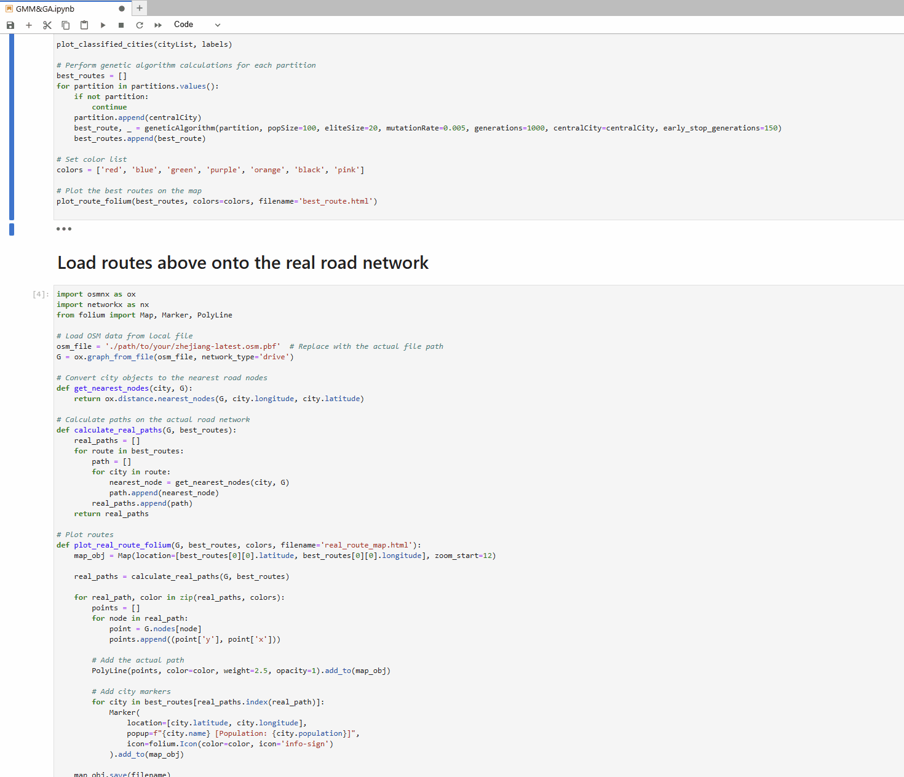
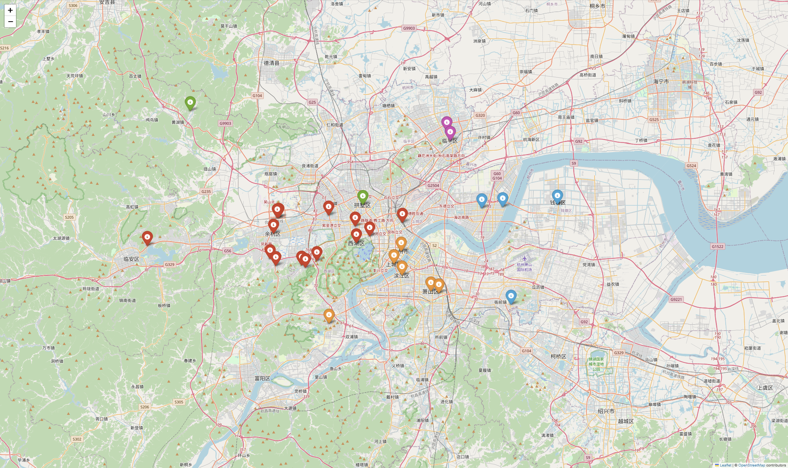
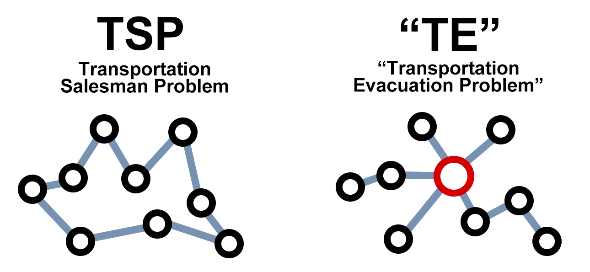

# Quickrview

# Background
I am planning bus routes for a project in the Wupenicity International Survey Competition (Traffic). Despite searching online, I have not found any open-source projects for traffic evacuation problems. I aim to develop a new algorithm to solve various optimization problems for central point evacuation using the radiating routes model, especially those involving thousands of points.

# Install
pip install:
numpy
pandas
matplotlib
folium
scikit-learn
tqdm
osmnx
networkx

# Contributing
Author: Yijie Gao,China
# License
MIT License

(c) 2024 ReedGAOOO

Permission is hereby granted, free of charge, to any person obtaining a copy
of this software and associated documentation files (the "Software"), to deal
in the Software without restriction, including without limitation the rights
to use, copy, modify, merge, publish, distribute, sublicense, and/or sell
copies of the Software, and to permit persons to whom the Software is
furnished to do so, subject to the following conditions:

The above copyright notice and this permission notice shall be included in all
copies or substantial portions of the Software.

All files in this repository, including data files such as `.xlsx` files, are
covered by this license.

THE SOFTWARE IS PROVIDED "AS IS", WITHOUT WARRANTY OF ANY KIND, EXPRESS OR
IMPLIED, INCLUDING BUT NOT LIMITED TO THE WARRANTIES OF MERCHANTABILITY,
FITNESS FOR A PARTICULAR PURPOSE AND NONINFRINGEMENT. IN NO EVENT SHALL THE
AUTHORS OR COPYRIGHT HOLDERS BE LIABLE FOR ANY CLAIM, DAMAGES OR OTHER
LIABILITY, WHETHER IN AN ACTION OF CONTRACT, TORT OR OTHERWISE, ARISING FROM,
OUT OF OR IN CONNECTION WITH THE SOFTWARE OR THE USE OR OTHER DEALINGS IN THE
SOFTWARE.
